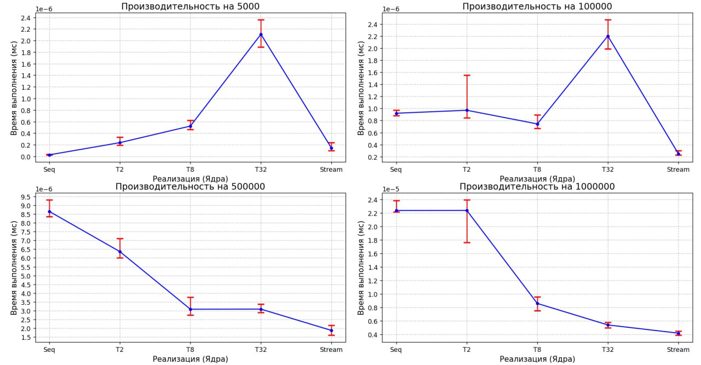
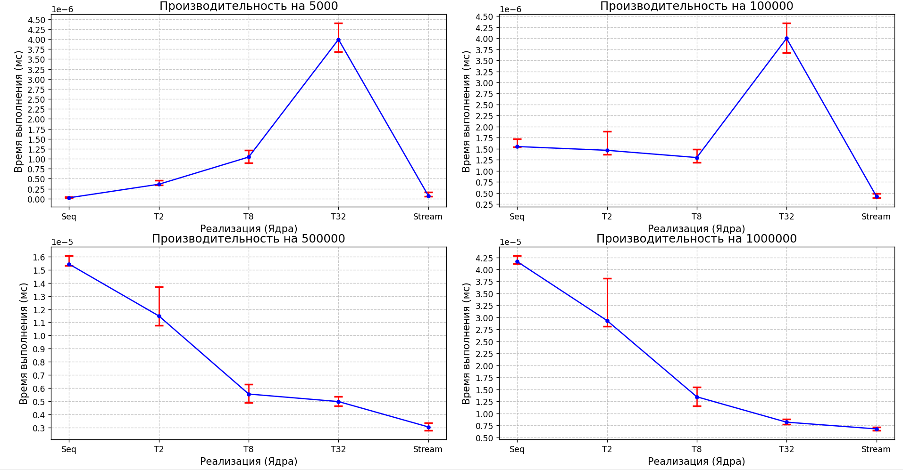

#### Задача
В данной задаче реализованы 3 алгоритма
поиска составного числа в массиве простых чисел.

1. Seq - пследовательный перебор
2. Т1..Т32 - параллельный поиск с использованием потоков запущеных Thread.start(), 
где номер - это количество потоков.
3. Stream - реализация с помощью parallelStream

Алгоритм получает на вход массив чисел и выдает
в качестве резальтата true - если составное число
найдено, иначе false

#### Исследование скорости поиска
Проведено исследование скорости работы этих алгоритмов.
Для этого было сгенеровано 4 массива простых чисел с помощью
алгоритма "решето эратосфена":
1. 5000 - простые числа до 5000 (около 700 штук)
2. 100000 - простые числа до 100000 ()
3. 500000 - простые числа до 500000 ()
4. 1000000 - простые числа до 1000000 ()

#### Исследование
Произведено измерение скорости работы каждого алгоритма
на каждом наборе данных. Для этого мы запустили алгоритм
N раз и вычислили среднее время работы алгоирма `avg`
и 80% доверительный интервал `[tmin,tmax]`. Проведено несколько запусков и 
N было подобрано настолько большим, чтобы среднее и доверительный интервал
были корректными.

Результаты исследвания скорости работы алгоритмов предсталены
на следующем рисунке.

Рис 1. Измерение скорости работы алгоритмов на 4 наборах данных и 100 запусков
По оси Y отложено время выполнения в миллисекундах включая 80% доверительные интервалы.
По оси X - указаны разлисные алгоритмы.
Seq - алгоритм последовательный,
T2, T8, T32 - паралельный с указанием количества потоков и
Stream - parallel stream.

Указано среднее значение и 80% доверительный интервал
(то есть 80% запусков по времени попало в данный интервал)

Проведено 100 запусков

 - граф с 1000 запусками
Рис 2. Измерение скорости работы алгоритмов на 4 наборах данных и 1000 запусков
По оси Y отложено время выполнения в миллисекундах включая 80% доверительные интервалы.
По оси X - указаны разлисные алгоритмы.
Seq - алгоритм последовательный,
T2, T8, T32 - паралельный с указанием количества потоков и
Stream - parallel stream.

Указано среднее значение и 80% доверительный интервал
(то есть 80% запусков по времени попало в данный интервал)

Проведено 100 запусков
